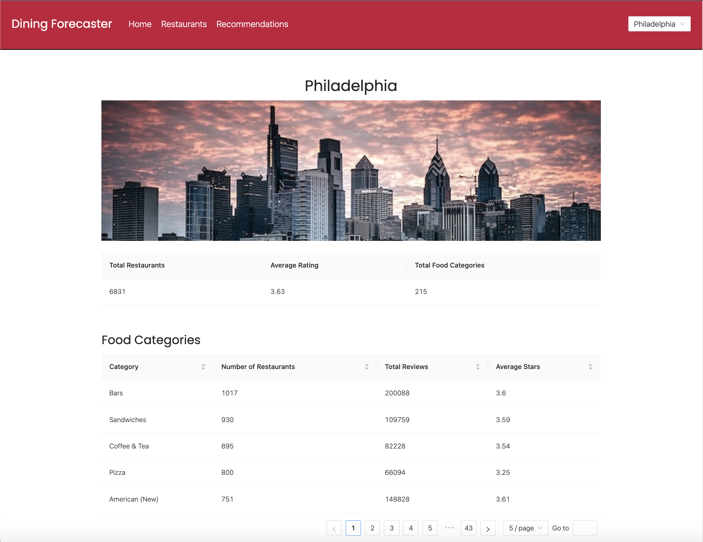
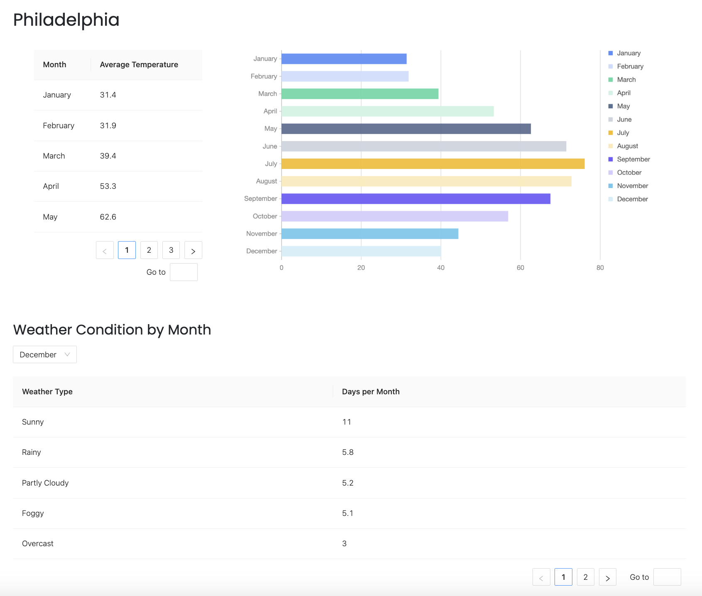
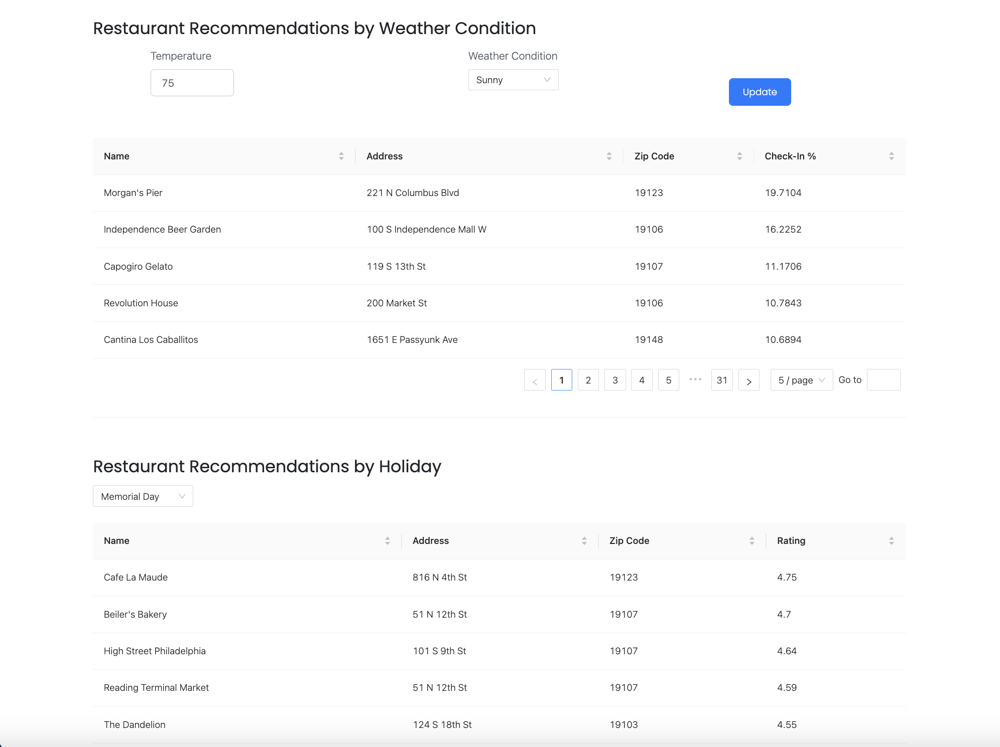

# Dining Forecaster

### Overview 
Dining Forecaster is a full-stack web application built for CIS-5500, a Database Management Systems course offered within the University of Pennsylvania's MCIT program. It uses two large-scale datasets (the [Yelp Open Dataset](https://www.yelp.com/dataset/) and a [historical weather dataset](https://www.kaggle.com/datasets/selfishgene/historical-hourly-weather-data)) to analyze dining trends in cities across the U.S.

Since the Yelp businesses dataset isn't intended for public display, I'm currently not hosting the application publicly and am keeping the project's source code in a private repository. But I would be happy to provide a demonstration and walk-through for anyone who is interested in learning more. (To do so, please [contact me](mailto:jeremygleason@icloud.com).) I've also provided screenshots below that provide an overview of the application's functionality.

### Screenshot 1: Homepage

### Screenshot 2: Weather statistics for specified city

### Screenshot 3: Dining trends by weather condition and time of year

